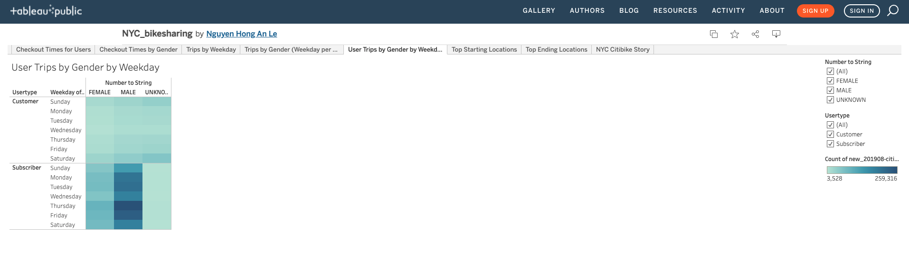

# bikesharing
An analysis of NYC CitiBike bike-sharing data from August 2019, with Tableau
[at the link](https://public.tableau.com/app/profile/nguyen.hong.an.le)
## Table of Contents

- [Overview of Project](#overview-of-project)
- [Results](#results)
- [Summary](#summary)

### Overview of Project
This project is an analysis of New York Citi Bike data, using data visualization tools to explore the viability of a bike-sharing business in Des Moines.

### Result

Bikes are mostly checked out for 4 to 6 hours.

Male users take approximately 3 times more rides than female users.

Most weekday rides are around 7:00 AM to 9 AM and 5:00 PM to 7:00 PM.

Weekend rides are highest from 10:00 AM to 7:00 PM.

Those rides are mostly taken by male users.

### Summary
The information shows high action of bicycle sharing assistance in New York during the long stretch of August 2019. 

The most distant larger part of the rides were in the extremely bustling Manhattan Island, taken by male clients during morning and evening times of heavy traffic. This infers that Citi Bike administrations are utilized as an option in contrast to public transportation by driving laborers. 

The extra examination would be advantageous by : 

contrasting information for various months with decided patterns across the year, 

counting climate information to discover the connection between the climate and the rides.
